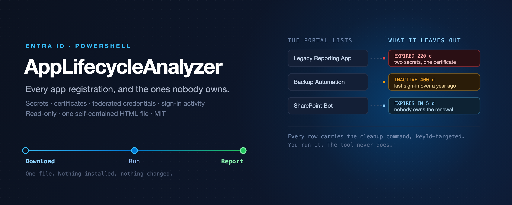
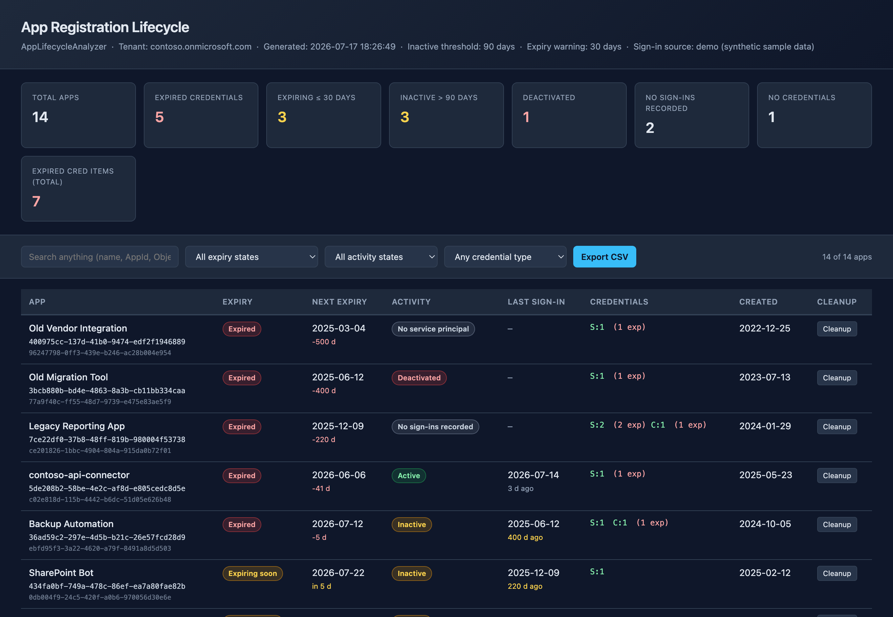

# App Lifecycle Analyzer




**Read-only lifecycle audit for Microsoft Entra ID app registrations — in one HTML report.**

Scans every app registration in your tenant and produces a single self-contained, interactive HTML
report: per app its secrets, certificates and federated credentials, their expiry, last sign-in
activity, and copy-only remediation commands for cleaning up what's expired or unused. Nothing is
changed in your tenant — the report *shows* you the fix command and lets you copy it; you run it in a
write-scoped session yourself.



> ▶ **See a sample:** open [`docs/sample-report.html`](docs/sample-report.html)
> in a browser — a fully populated demo report built from synthetic app
> registrations (no tenant was accessed).

## What it surfaces

- **Credential expiry** — secrets and certificates that are expired or expiring soon, per app.
- **Federated credentials** — apps using workload identity federation instead of secrets.
- **Sign-in activity** — when the app / service principal was last used (needs Entra ID P1/P2).
- **Cleanup commands** — copy-only `Remove-MgApplicationPassword` / cert removal, keyId-targeted, plus
  bulk "remove all expired" — never executed by the tool.

## Usage

```powershell
./AppLifecycleAnalyzer.ps1
```

The report opens in your browser: search, filter (has secret / cert / federated / none), and sort by
credential exposure. Click an app for detail and copy the exact remediation command.

Every parameter, with the permissions and the examples, is in the
**[script reference](docs/commands/AppLifecycleAnalyzer.md)** — generated from the script's own
comment-based help, so it cannot drift from what you downloaded. The same page is on the web at
[simonvedder.com/tools/app-lifecycle-analyzer/commands/applifecycleanalyzer](https://simonvedder.com/tools/app-lifecycle-analyzer/commands/applifecycleanalyzer/).

## Permissions

Read-only Microsoft Graph delegated scopes:
`Application.Read.All`, `Directory.Read.All`, `AuditLog.Read.All` (sign-in activity needs Entra ID P1/P2).

## Related

- **[Tool page](https://simonvedder.com/tools/app-lifecycle-analyzer/)** — what it finds and why, with a sample report you can open.
- **[Least Privilege Studio](https://github.com/simon-vedder/least-privilege-studio)** — Azure RBAC least-privilege tooling.
- **[RiskyRolesAnalyzer](https://github.com/simon-vedder/risky-roles-analyzer)** — the same idea for privileged role assignments.
- Write-up: [App Lifecycle Analysis for Entra ID](https://simonvedder.com/app-lifecycle-analysis-for-entra-id/)

---
by [Simon Vedder](https://simonvedder.com)
